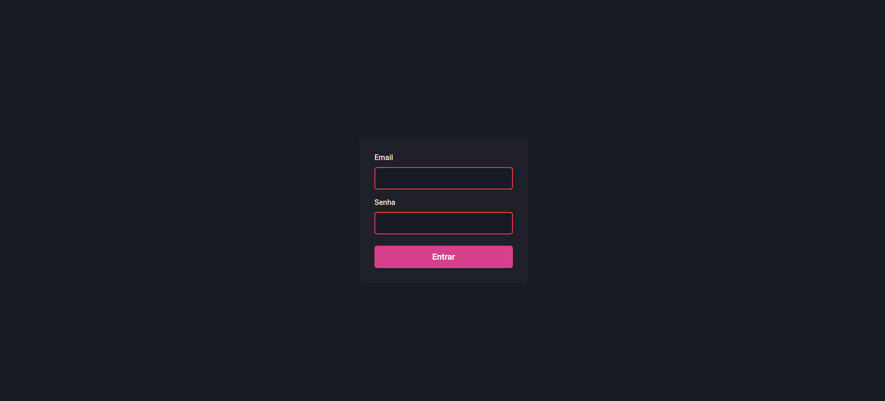
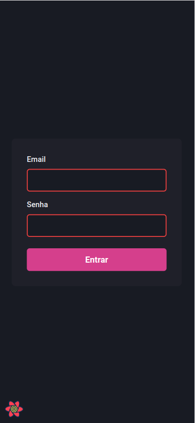
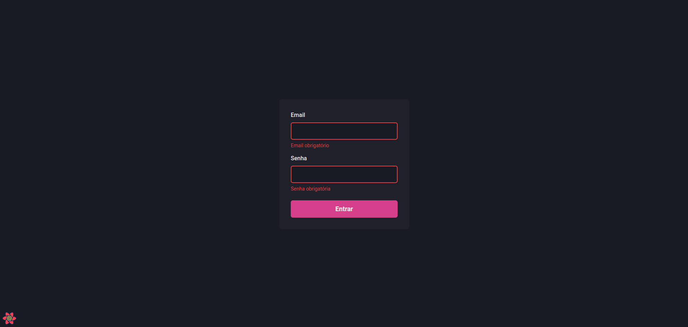
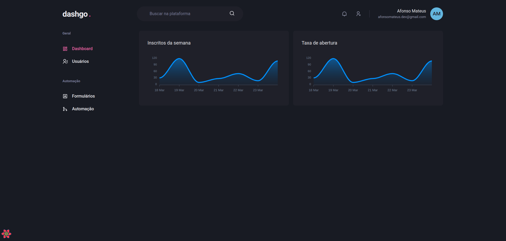
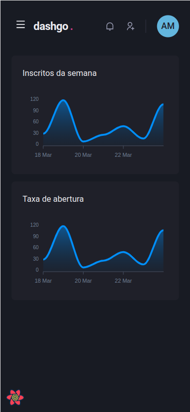

# Dashgo
## Exemplo de dashboard responsivo, utilizando NextJS

# 💻 Sobre
Este projeto foi concebido para o curso de NextJS da Rocketseat. Nele podemos visualizar um modelo de dashboard utilizando ChakraUI para desenvolvimento da interface e responsividade, além de validação de campos com React Hook Form e plotagem de gráficos com ApexCharts.

<h4 align="center"> 
	🚧  Dashgo 🚀 Em construção...  🚧
</h4>

# Funcionalidades
- [x] Responsividade
- [x] Validação email e senha com React Hook Form
- [x] Visualização de gráficos com ApexCharts
- [ ] Listagem de usuários


# 🎨 Layout
### Web







# Instalação
### Pré requisitos
Certifique-se de ter o [Node](https://nodejs.org/en/) e o [Git](https://git-scm.com) instalados, além de um gerenciador
de pacotes como o [Yarn](https://yarnpkg.com/) ou o [NPM](https://www.npmjs.com/).

### 🎨 Execução
```bash
# Clone o repositório
$ git clone <https://github.com/afonsomateus21/dashgo.git> ou
$ git clone <git@github.com:afonsomateus21/dashgo.git> se utilizar SSH

# Instale as dependências
$ npm install ou yarn install

# Execute a aplicação em modo de desenvolvimento
$ npm dev ou yarn dev

# O aplicação ficará disponível na porta:3000 - acesse <http://localhost:3000>
```

# 🛠 Tecnologias
As seguintes tecnologias foram utilizadas na construção do projeto:
- [TypeScript](https://www.typescriptlang.org/)
- [NextJS](https://nextjs.org/)
- [ChakraUI](https://chakra-ui.com/)
- [React Hook Forms](https://react-hook-form.com/)
- [ApexCharts](https://apexcharts.com/docs/react-charts/)
- [Mirage](https://miragejs.com/)
- [Axios](https://axios-http.com/ptbr/docs/intro)

# Autor
Afonso Mateus<br/>
<a href="https://www.linkedin.com/in/afonso-mateus-3a8522118/"></a>


# Licença
Este projeto está sob a licença [MIT](https://github.com/afonsomateus21/dashgo/blob/main/LICENSE)

Feito com ❤️ por Afonso Mateus 👋 [Entre em contato!](https://www.linkedin.com/in/afonso-mateus-3a8522118/)
